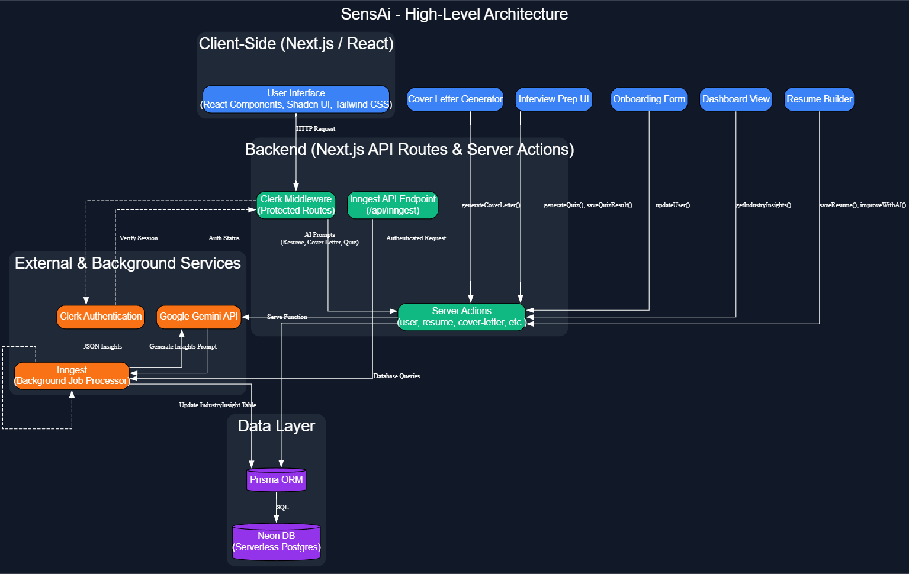

# SensAi: Full-Stack AI Career Assistant


## Executive Summary

SensAi – Full-Stack AI Career Assistant is a modern, AI-powered platform that provides users with personalized, data-driven career guidance, including resume building, cover letter creation, and interview preparation. The application leverages the Google Gemini API to offer a suite of intelligent tools, including a resume builder with AI-powered suggestions, a cover letter generator, and an adaptive interview preparation system. The platform is built with a modern tech stack, featuring Next.js for the front end, a serverless backend with a Neon DB PostgreSQL database, and Prisma ORM for efficient data management.

---

### 🧠 AI-Powered Features & Technical Implementation

| 🧩 Feature                      | ⚙️ Technical Implementation                                                                                                                                    |
| ------------------------------- | -------------------------------------------------------------------------------------------------------------------------------------------------------------- |
| **AI Career Guidance**          | Uses **Google Gemini API** to provide personalized career recommendations based on user goals, skillset, and industry insights.                                |
| **Resume Builder**              | Form-based and markdown editors for flexible resume creation. Resumes are stored in structured format and converted to **PDF**. Data is validated server-side. |
| **Cover Letter Generator**      | Accepts job descriptions and uses **Gemini API** to generate tailored letters. Letters are saved with metadata for version control and user management.        |
| **Interview Preparation**       | Dynamically generates mock interview questions using Gemini AI. Tracks performance metrics, visualized with **Recharts** (interactive analytics).              |
| **Industry Insights Dashboard** | Weekly background jobs via **Inngest** fetch real-time salary data, skill demand, and trends. Ensures 100% data freshness across 15+ domains.                  |


----

## 🏗️ System Architecture

The SensAi platform is built on a modern, scalable, and serverless architecture designed for performance and maintainability. The system is logically divided into several layers, each with distinct responsibilities, from the user interface to the data and external services.

```
SensAi/
├── 📁 app/                     # Next.js App Router (Core Application)
│   ├── 📁 (auth)/              # Authentication-related pages (Clerk)
│   ├── 📁 (main)/              # Main application features (Protected Routes)
│   └── 📁 api/                 # API routes (Inngest webhook)
├── 📁 actions/                 # Server-side logic (Next.js Server Actions)
├── 📁 components/              # Reusable React components (Shadcn UI)
├── 📁 lib/                      # Helper functions and client initializations
│   ├── 📁 inngest/             # Inngest client and background job definitions
│   └── 📄 prisma.js            # Prisma client for database access
├── 📁 prisma/                   # Database schema and migrations
└── 📄 middleware.js            # Authentication and route protection

```


<p align="center">
  
  <br/>
  <em>A high-level overview of the SensAi platform, illustrating the interaction between the Next.js frontend, serverless backend, and external services like Google Gemini and Inngest.</em>
</p>


### Architectural Breakdown

#### 1\. **Client-Side (Frontend)**

The frontend is a dynamic and responsive user interface built with **Next.js** and **React**, following the modern **App Router** paradigm.

  * **UI Components**: The user interface is composed of reusable components from **Shadcn UI**, styled with **Tailwind CSS**. This creates a consistent and visually appealing user experience.
  * **Routing**: The application uses a file-based routing system, with distinct layouts for authentication (`app/(auth)`) and the main application (`app/(main)`), ensuring a clean separation of public and protected areas.
  * **State Management**: Client-side state is managed with a combination of React's built-in hooks and custom hooks, such as `useFetch` for handling data fetching and loading states.

#### 2\. **Server-Side (Backend)**

The backend is built using a serverless approach with **Next.js Server Actions** and API routes, enabling a seamless integration between the client and server.

  * **Server Actions**: The core of the backend logic is implemented using Server Actions, which allow for direct, secure communication between the client and server without the need for traditional API endpoints. This is used for all major operations, including user updates, resume and cover letter generation, and interview assessment.
  * **Authentication & Authorization**: User authentication is handled by **Clerk**, with a robust middleware system to protect routes and manage user sessions. This ensures that only authenticated users can access the main application features.

#### 3\. **Data Layer**

The data layer is responsible for persisting and managing all application data, using a combination of a serverless database and a modern ORM.

  * **Database**: The application uses **Neon DB**, a serverless PostgreSQL database, which provides a scalable and cost-effective solution for data storage.
  * **ORM**: **Prisma** is used as the Object-Relational Mapper (ORM), providing a type-safe and intuitive way to interact with the database. The database schema and migrations are managed through Prisma, ensuring a consistent and version-controlled database structure.

#### 4\. **External and Background Services**

The SensAi platform integrates with several third-party services to provide its intelligent features and handle asynchronous tasks.

  * **Google Gemini API**: The core AI features are powered by the Google Gemini API, which is used for generating content for resumes, cover letters, and interview questions.
  * **Inngest**: Background jobs, such as the weekly generation of industry insights, are managed by **Inngest**. This allows for long-running tasks to be executed without blocking the main application thread, ensuring a smooth user experience.

## How to Build and Run

### Prerequisites

  * Node.js (v18.18.0 or later)
  * npm

### Compilation (Makefile Recommended)

This project does not use a Makefile for compilation. Instead, you can use the following npm scripts to build and run the application:

  * `npm run dev`: Starts the development server.
  * `npm run build`: Builds the application for production.
  * `npm run start`: Starts the production server.
  * `npm run lint`: Lints the code.

### Execution

1.  Clone the repository:
    ```bash
    git clone https://github.com/AkshayTiwari27/SensAi.git
    cd SensAi
    ```
2.  Install NPM packages:
    ```bash
    npm install
    ```
3.  Set up your environment variables. Create a `.env` file in the root of your project and add the following:
    ```env
    # Database
    DATABASE_URL="your_neon_db_url"

    # Clerk Authentication
    NEXT_PUBLIC_CLERK_PUBLISHABLE_KEY=your_clerk_public_key
    CLERK_SECRET_KEY=your_clerk_secret_key
    NEXT_PUBLIC_CLERK_SIGN_IN_URL=/sign-in
    NEXT_PUBLIC_CLERK_SIGN_UP_URL=/sign-up
    NEXT_PUBLIC_CLERK_AFTER_SIGN_IN_URL=/onboarding
    NEXT_PUBLIC_CLERK_AFTER_SIGN_UP_URL=/onboarding

    # Google Gemini API
    GEMINI_API_KEY=your_gemini_api_key
    ```
4.  Run database migrations:
    ```bash
    npx prisma migrate dev
    ```
5.  Start the development server:
    ```bash
    npm run dev
    ```
6.  Open [http://localhost:3000](https://www.google.com/search?q=http://localhost:3000) with your browser to see the result.

## Usage Demonstration

To use the SensAi platform, simply visit the live demo link and create an account. Once you're logged in, you can start using the various tools to help you advance in your career.

### 📌 Live Demo

[🚀 Click here to view the deployed project](https://sensai-brown.vercel.app/)

## Future Enhancements

The SensAi platform is constantly evolving, with new features and improvements being added all the time. Some potential future enhancements include:

  * **Job Application Tracker**: A tool to help users track their job applications and manage their job search process.
  * **Networking Hub**: A feature to help users connect with other professionals in their industry and build their professional network.
  * **Salary Negotiation Coach**: An AI-powered tool to help users prepare for salary negotiations and get the compensation they deserve.
